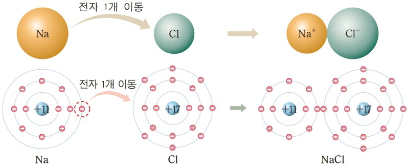
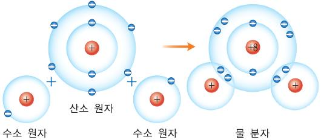

# science   
## 빅뱅
우주는 한점에서 시작해 폭발후 지금까지의 우주가 생김
## 빅뱅 과정
1.**쿼크,전자** 가 빅뱅후 최초로 생성되었다   
2.온도가 낮아져 **쿼크 3개** 가 결합해 **양성자와 중성자**가 생겼다    
3.온도가 더 낮아져 **양성자와 중성자**가 결합해 **수소 원자핵과 헬륨 원자핵**이 생겼다   
4.온도가 더 낮아져 **전자**와 **원자핵**이 결합해 **수소 원자와 헬륨 원자**가 생겼다    
## 빅뱅 우주론
- **가모프**등이 주장했다      
- 우주의 **부피** 는 증가한다    
- 우주의 **질량** 은 일정하다    
- 우주의 **밀도와 온도** 는 하락한다    
## 정상 우주론
- **호일** 등이 주장했다   
- 우주의 **부피** 는 증가한다  
- 우주의 **질량** 은 증가한다
- 우주의 **밀도와 온도** 는 일정하다
## 우주 배경 복사   
### 개념   
빅뱅 후 **약38만년** 후 우주의 온도가 **약 3000k** 일때 **수소 원자** 와 **헬륨 원자** 가 생성되므로서 우주로 펴저나가   
우주 전체를 채우고 있는 빛
### 알 수있는점   
**빅뱅 우주론** 을 뒷받침 해줌    
## 스펙트럼    
### 연속 스펙트럼   
고온의 광원이 빛을 방출하는 경우 **예** :백열등     
연속적인 색의띠    
## 선스펙트럼  
### 방출 스펙트럼    
검은 바탕의 선   
고온의 별 주위에서 에너지를 얻어 가열된 기체가 빛을 방출하는 경우   
### 흡수 스펙트럼   
연속 스펙트럼의 흡수선이 빠진것   
별빛이 저온의 기체를 통과할 때 흡수되고 남은 빛에 의해 생긴다   
### 알 수 있는 것
**원소의 종류** 와 **원소의 함량** 을 알 수 있음
## 원소 주기율 표
### 족
**세로줄** **원자가 전자** 로 분리함   
### 주기
**가로줄** **원자의 껍데기 수** 로 분리함   
### 특징
18족은 안정해서 다른 원자들이 18족 처럼 되고 싶어함   
그래서 가장 쉽게 전자를 잃거나 얻어서  **이온** 이 됨
전자를 잃으면 **양이온** 얻으면 **음이온**   
### 알칼리 금속   
1족에 속하는 금속 원소   
산소와 반응 잘함 -> 광택을 잃음   
물과 반응 잘함 -> 염기성 기체 생성   
쉽게 잘림 -> 무르다   
**실생활 예**  
휴대전화 배터리**리튬** 터널의 조명**나트륨** 비료**칼륨**    
### 할로젠  
17족에 속하는 비금속 원소   
비활성 기체(18족 기체들)이 되고 싶어함   
**실생활 예**  
충치 예방용 치약**플루오린** 수영장 물의 소독제**염소** 상처 소독약**아이오딘**   
## 이온 결합
위에서 잠깐 봤듯이 18족원소가 되려고 전자를 잃거나 얻음   
이온들끼리 결합하려고 함(단 **양이온** 과 **음이온**끼리만 됨)   
전자수 맞춰서 써야함 **예** 염화 나트륨(NaCl) = Na+ : Cl- = 1:1 = NaCl     
      
식은 양이온이 앞으로 음이온이 뒤에 온다       
쓸때는 음이온(마지막이 소로 끝날경우 화로 바꿈 **예** 산소 -> 산화) 양이온 순임    
## 공유 결합
기체가 결합 할때는 버리거나 얻지 않고 서로 전자를 공유함   
**예** H+ + O2- = 2:1 = H2O     
    